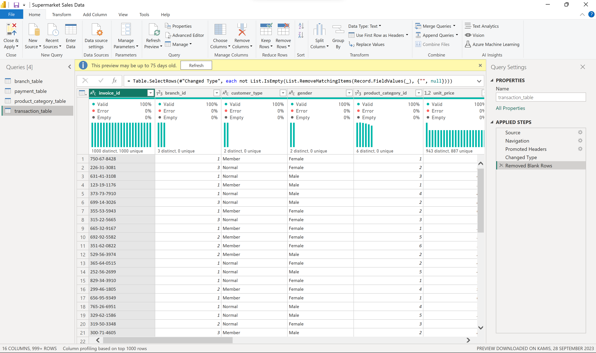
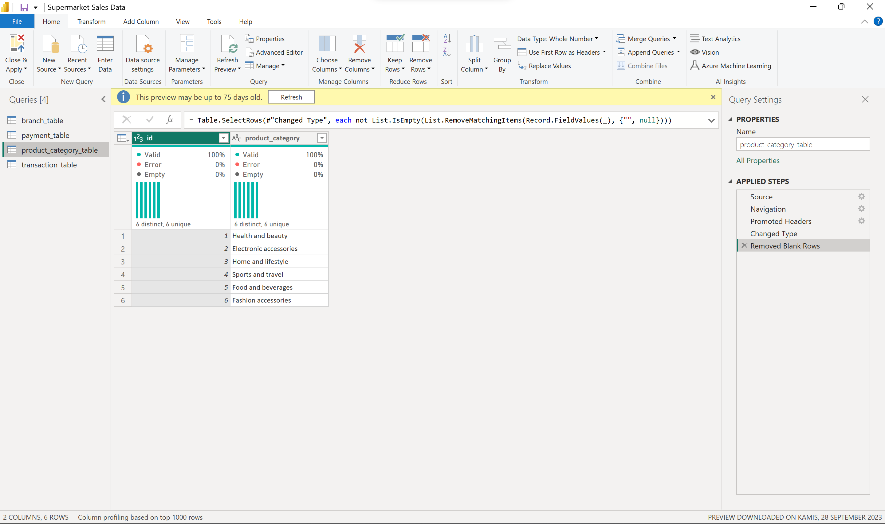
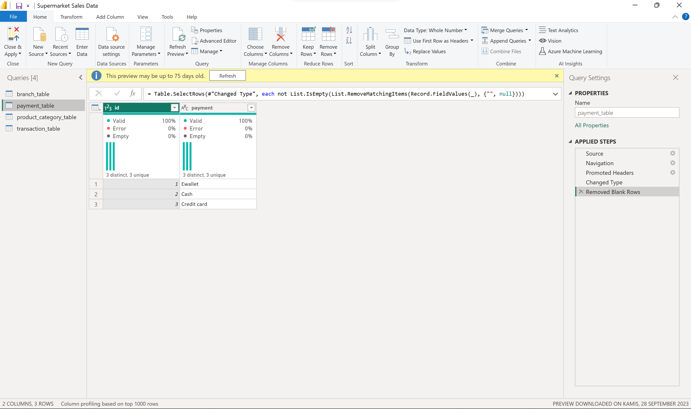
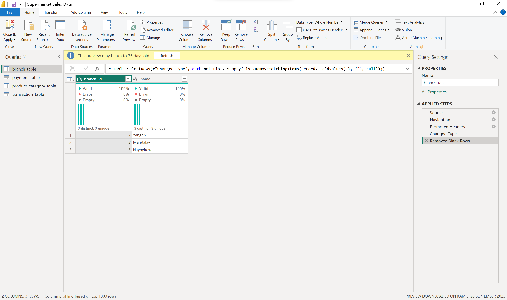
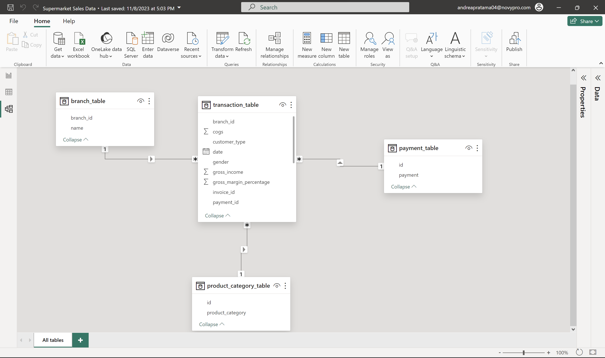
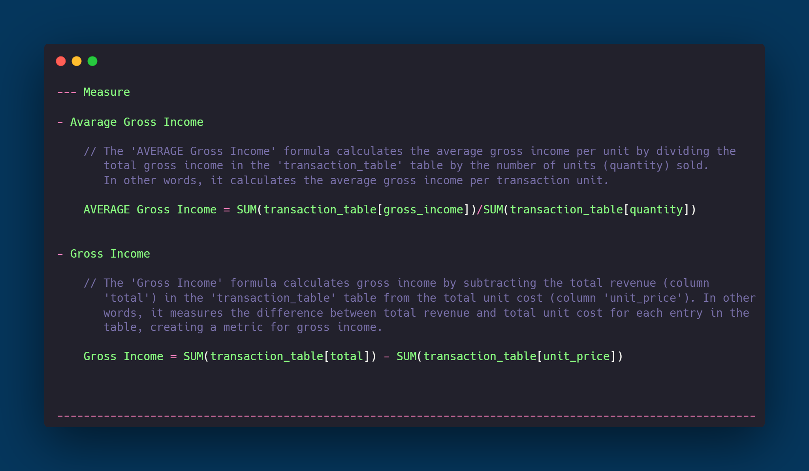

# Supermarket Sales

## Introduction
This project aims to analyze supermarket sales using a Power BI dashboard. The two main pages will focus on product types and the correlation between unit price and gross income.

## Problem Statement
How can we gain insights into product contributions to sales and examine the correlation between unit prices and gross income in the context of supermarket sales.

## Skill Demonstrated
- Utilizing Power BI to create interactive dashboards
- Sales data analysis and data transformation
- Using various types of charts and data visualization
- Analyzing correlations between variables in a dataset

## Data Sourcing
The data for this project was sourced from Refocus, a data provider offering information on supermarket sales.

## Data Transformation
The data underwent processing to eliminate invalid values, categorize data by product type, and prepare it for further analysis.

| Data Cleaning | Data Cleaning |
| -------------- | -------------- |
|  |  |
|  |  |

## Modeling
Automatically derived relationships are adjusted to remove and replace unwanted relationships with the required.

The Model is Star Schema.

There are 3 dimension table and 1 fact table. The dimension table are all joined to the fact table with a one-to-many relationship.

Dax used in this project

## Analyze & Visualization
The dashboard presents an analysis of sales based on product types and the correlation between unit prices and gross income. The first page provides insights into product contributions to sales, while the second page displays the correlation between quantity and gross margin.

### In this report have 2 page :
- Dashboard
- Corelation Quantity & Gross Margin

## Conclusion & Recomendation

- Top Contributing Products to Gross Income:
  The analysis reveals that the three products contributing the most to gross income are Food and Beverages, Sport and Travel, and Electronic Accessories.
  Customer Satisfaction Insights:
- The top three products with the highest customer satisfaction are Food and Beverages, Fashion and Accessories, and Health and Beauty.
  Daily Sales Performance:
- The daily sales performance graph displays dynamic fluctuations, with increases in purchases consistently followed by decreases. However, there is no stable and continuous increase in sales, 
  suggesting the need for a targeted marketing strategy to boost overall sales.
- Top-Selling Categories:
  The analysis identifies Electronic Accessories, Food and Beverages, and Sport and Travel as the three highest-selling categories.
- Correlation Between Quantity and Gross Income:
  A notable correlation exists, indicating a linear relationship between the quantity of items sold and gross income. Higher quantities sold result in higher gross income, and this correlation 
  holds true across all product categories.
- Gross Income per Quantity:
  The gross income per quantity of item sold is consistent at $2.79, providing a clear understanding of the financial performance associated with each sold item.
- High-Performing Products:
  Fashion Accessories, Sport and Travel, and Home Lifestyle are the top three products with gross incomes above the average, suggesting these products contribute significantly to overall revenue.

Implement targeted marketing for top categories, optimize inventory to meet demand, adjust prices for high-grossing products, and enhance customer satisfaction initiatives. These strategies aim to stabilize sales, maximize revenue, and foster customer loyalty for sustained growth.
